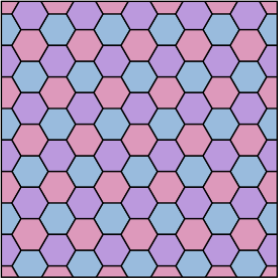
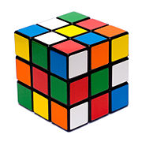

# Parcourir - `tuple`

Dans ce chapitre, nous allons découvrir le concept très important de la séquence. Ce concept s'appelle `tuple` en langage Python ou **n-uplet** en français. Une séquence est un regroupement d'objets, par exemple de couleurs, de distances ou d'angles. Ce qui est très intéressant, c'est que nous pouvons parcourir les valeurs d'une séquence l'une après l'autre avec une boucle. Nous allons voir que :

- la structure `(10, 20, 10)` représente une séquence (`tuple`),
- dans la boucle `for x in (10, 20, 10):` la variable `x` parcourt des nombres,
- dans la boucle `for x in ('red', 'blue'):` la variable `x` parcourt des couleurs.

```{question}
En informatique, un `tuple` est 

{v}`une séquence d'objets`  
{f}`une liste numérique`  
{f}`un ensemble mathématique`  
{f}`une chaîne de caractères`
```

Auparavant nous avons vu la boucle `for` comme une simple répétition. Nous avons répété x fois exactement les mêmes instructions pour chaque tour. Dans ce chapitre la boucle `for` est différente dans le sens que nous parcourons une séquence et nous utilisons une valeur différente pour chaque tour. En Python, cette idée de *parcourir une séquence* et d'utiliser une *valeur successive* à chaque tour, est un concept fondamental.

## Parcourir des couleurs

Pour dessiner de multiples couleurs, nous pouvons définir une séquence (tuple) de couleurs et parcourir cette séquence.
En Python, une séquence est délimitée par des parenthèses `()` et les éléments sont séparé par une virgule.

Dans l'expression `for x in (...)`, la variable `x` va prendre à tour de rôle les valeurs dans la séquence. Dans l'exemple ci-dessous, `x` prendra successivement les valeurs : `'blue'`, `'cyan'`, `'red'`, etc. Le bloc indenté qui suit la ligne `for` sera répété autant de fois que la séquence contient d'éléments.

```{codeplay}
:file: tuple1.py
from turtle import *
up()

backward(200)
for x in ('blue', 'cyan', 'red', 'magenta', 'pink', 'lime'):
    dot(80, x)
    forward(80)
```

**Exercice** : Modifiez la séquence des couleurs.

## Parcourir des diamètres

Nous pouvons également parcourir une séquence de nombres et ainsi, par exemple, spécifier une série de diamètres de disques.

```{codeplay}
:file: tuple2.py
from turtle import *
up()

backward(220)
for x in (20, 40, 60, 80, 100):
    dot(x, 'red')
    forward(x + 40)
```

**Exercice** : Modifiez la séquence des diamètres.

## Parcourir des distances

Dans le chapitre **Definir** nous avons vu les fonctions `batiment()` et `porte()` avec 8 lignes pour chaque défintion de fonction.

```{codeplay}
:file: def3.py
from turtle import *

def batiment():
    forward(200)
    left(90)
    forward(100)
    left(90)
    forward(200)
    left(90)
    forward(100)
    left(90)

def porte():
    forward(30)
    left(90)
    forward(50)
    left(90)
    forward(30)
    left(90)
    forward(50)
    left(90)

batiment()
forward(30)
porte()
```

A l'aide d'une séquence, nous pouvons écrire ces fonctions de manière bien plus compacte.

```{codeplay}
:file: tuple3.py
from turtle import *

def batiment():
    for x in (200, 100, 200, 100):
        forward(x)
        left(90)

def porte():
    for x in (30, 50, 30, 50):
        forward(x)
        left(90)

porte()
forward(50)
batiment()
```

**Exercice** : Placez la porte à l'intérieur du bâtiment et coloriez-la en rouge.

## Parcourir des angles

Nous allons reprendre notre fonction `maison()` et, à l'aide d'une séquence, nous pouvons l'écrire de manière bien plus compacte. Cette fois-ci, la séquence représente des angles, donc nous nommons notre variable `a` pour nous rappeler que c'est un angle.

```{codeplay}
:file: tuple4.py
from turtle import *

def maison():
    forward (70)
    for a in (90, 45, 90, 45):
        left(a)
        forward(50)
    left(90)

backward(200)        
maison()
forward(100)
maison()
```

**Exercice** : Ajoutez une porte et une fenêtre à la maison.

## Maisons en couleurs

Dans l'exemple nous allons d'abord parcourir une séquence d'angles avec une variable d'itération `a` pour dessiner une maison.

Ensuite, nous allons parcourir une séquence de couleurs avec une variable `c` pour dessiner des maisons de différentes couleurs.

```{codeplay}
:file: tuple5.py
from turtle import *

def maison():
    forward (70)
    for a in (90, 45, 90, 45):
        left(a)
        forward(50)
    left(90)

backward(250)
for c in ('red', 'yellow', 'pink', 'lightblue', 'lightgreen'):
    fillcolor(c)
    begin_fill()       
    maison()
    end_fill()
    forward(100)
```

**Exercice** : Changez les couleurs des maisons.

## Drapeau LGBT

Le [drapeau arc-en-ciel](https://fr.wikipedia.org/wiki/Drapeau_arc-en-ciel), ou également appelé le drapeau de la paix, est un drapeau représentant plusieurs bandes ayant les couleurs d'un arc-en-ciel. L'usage du drapeau arc-en-ciel est une ancienne tradition commune à de nombreuses cultures. Il évoque généralement la paix, la diversité sexuelle et de genre, ainsi que l'harmonie entre les individus dans le monde entier.

Aujourd'hui, le drapeau arc-en-ciel est majoritairement connu comme celui de la communauté lesbienne, gay, bisexuelle, transgenre, (abréviation : LGBT), depuis 1978.

```{codeplay}
:file: LGBT.py
from turtle import *

backward(300)
left(90)
forward(167)
right(90)
width(67)

for x in ('red', 'orange', 'yellow', 'green', 'blue', 'purple'):
    pencolor(x)
    forward(600)
    backward(600)
    right(90)
    forward(67)
    left(90)
```

## Fleur

Ci-dessous nous dessinons 6 fois un losange pour obtenir une fleur.
Avec une boucle `for` nous parcourons une séquence de 6 couleurs alternantes.

```{codeplay}
:file: tuple6.py
from turtle import *
getscreen().bgcolor('lightgreen')

def losange():
    begin_fill()
    for a in (60, 120, 60, 120):
        forward(100)
        left(a)
    end_fill()

for c in ('pink', 'red', 'pink', 'red', 'pink'):
    fillcolor(c)
    losange()
    left(60)
```

**Exercice** : Il manque un pétale, corrigez le programme.

## Sourire

Dans cet exemple nous allons parcourir différentes épaisseurs et nous appelons notre variable `w` (width). Voici quatre smileys avec différentes formes de bouche.

```{codeplay}
:file: tuple7.py
from turtle import *
getscreen().bgcolor('lightgreen')
up()

def smiley():
    dot(100, 'yellow')

    left(45)
    forward(20)
    dot(15)

    right(45)
    backward(30)
    dot(15)

    right(90)
    forward(30)
    left(90)
    down()
    forward(30)
    up()

backward(200)
for w in (1, 5, 10, 20):
    width(w)
    smiley()
    forward(120)
    left(5)
```

**Exercice** : Faites varier un autre paramètre, par exemple la distance des yeux, ou la taille d'un œil.

## Etonnement

Cette fois, nous faisons varier le diamètre de la bouche.

```{codeplay}
:file: tuple8.py
from turtle import *

getscreen().bgcolor('skyblue')
up()

backward(200)
for d in (10, 20, 30, 40):
    dot(100, 'yellow')

    left(45)
    forward(20)
    dot(15)

    right(45)
    backward(30)
    dot(15)

    right(60)
    forward(35)
    dot(d)
    left(60)
    
    forward(120)
    left(5)
```

## Cube 3D

Avec trois losanges, nous pouvons dessiner un cube en 3D.

```{codeplay}
from turtle import *

def losange():
    for a in (120, 60, 120, 60):
        forward(100)
        left(a)
        
for i in range(3):
    losange()
    left(120)
```

## Cube en couleur

Avec l'utilisation de trois couleurs, l'effet 3D est accentué.
Nous choisissons des couleurs claires pour les surfaces du haut, et des couleurs sombres pour les surfaces vers le bas.

```{codeplay}
from turtle import *

def losange():
    for a in (120, 60, 120, 60):
        forward(100)
        left(a)

def cube():      
    for c in ('pink', 'violet', 'darkviolet'):
        fillcolor(c)
        begin_fill()
        losange()
        end_fill()
        left(120)

cube()
```

**Exercice** : Tournez le cube de 30°.

## Pavage du plan

Un pavage du plan est un ensemble de portions du plan, par exemple des polygones, dont l'union est le plan tout entier, sans recouvrement.

```{codeplay}
from turtle import *

def losange():
    for a in (120, 60, 120, 60):
        forward(100)
        left(a)
        
def cube():
    for c in ('pink', 'violet', 'darkviolet'):
        fillcolor(c)
        begin_fill()
        losange()
        end_fill()
        left(120)

for i in range(3):
    backward(100)
    cube()
    forward(100)
    left(120)
```

## Cube de Rubik

Pour dessiner un cube de Rubik, nous dessinons 

- 3 losanges pour former une ligne,
- 3 lignes pour former une surface,
- 3 surfaces pour former un cube.

Dans chaque fonction (losange, ligne, surface) nous retournons au point de départ.

```{codeplay}
from turtle import *
speed(8)

def losange():
    begin_fill()
    for a in (120, 60, 120, 60):
        forward(50)
        left(a)
    end_fill()

def ligne():
    for i in range(3):
        losange()
        forward(50)
    backward(150)

def surface():
    for i in range(3):
        ligne()
        left(120)
        forward(50)
        right(120)
    left(120)
    backward(150)
    
for c in ('red', 'green', 'blue'):
    fillcolor(c)
    surface()
```

## Minecraft

[Minecraft](https://fr.wikipedia.org/wiki/Minecraft) est un jeu vidéo de type aventure *bac à sable* développé par le Suédois Markus Persson, puis par la société Mojang Studios, sorti en 2011. Il s'agit d'un univers composé de voxels.

Le voxel (mot créé en contractant *volume* et *element*) est à la 3D ce que le pixel est à la 2D.

Le programme suivant aligne 3 blocs pour former une rangée.

```{codeplay}
from turtle import *

def losange():
    for a in (120, 60, 120, 60):
        forward(50)
        left(a)

def cube():      
    for c in ('lime', 'peru', 'sienna'):
        fillcolor(c)
        begin_fill()
        losange()
        end_fill()
        left(120)

speed(5)
left(30)
for i in range(3):
    cube()
    forward(-50)
```

Ce programme empile 3 blocs pour former une colonne.

```{codeplay}
from turtle import *

def losange():
    for a in (120, 60, 120, 60):
        forward(50)
        left(a)

def cube():      
    for c in ('lime', 'peru', 'sienna'):
        fillcolor(c)
        begin_fill()
        losange()
        end_fill()
        left(120)

speed(5)
left(30)
for i in range(3):
    cube()
    left(60)
    forward(50)
    right(60)
```

## Exercices

- Téléchargez un exercice.
- Editez-le dans un éditeur.
- Déposez-le sur Moodle.


### Minecraft - escalier

Avec les cubes de Minecraft créez un escalier avec 4 marches.

```{codeplay}
:file: minecraft_ex1.py
from turtle import *

def losange():
    for a in (120, 60, 120, 60):
        forward(50)
        left(a)

def cube():      
    for c in ('lime', 'peru', 'sienna'):
        fillcolor(c)
        begin_fill()
        losange()
        end_fill()
        left(120)

speed(0)
left(30)
cube()
```

### Minecraft - portail

Avec les cubes de Minecraft créez un portail 4x4 en forme de π.

```{codeplay}
:file: minecraft_ex2.py
from turtle import *

def losange():
    for a in (120, 60, 120, 60):
        forward(50)
        left(a)

def cube():      
    for c in ('lime', 'peru', 'sienna'):
        fillcolor(c)
        begin_fill()
        losange()
        end_fill()
        left(120)

speed(0)
left(30)
cube()
```

### Pavage hexagonal

Le pavage hexagonal est, en géométrie, un pavage du plan euclidien constitué d'hexagones réguliers.



Parcourez les 3 couleurs pour dessiner une surface tricolore, soit alignée linéairement, soit autour d'un point commun. Répétez ensuite cette surface élémentaire pour créer un pavage.

```{codeplay}
:file: pavage.py
from turtle import *

def hexagone():
    for i in range(6):
        forward(40)
        left(60)

hexagone()
```

### Cube de Rubik

A l'aide de tuples de couleurs, dessinez le cube de Rubik suivant.




```{codeplay}
:file: rubik.py
from turtle import *

def losange():
    for a in (120, 60, 120, 60):
        forward(50)
        left(a)


losange()
```

### Tetris

Le jeu vidéo [Tetris](https://fr.wikipedia.org/wiki/Tetris) est un puzzle conçu par l'informaticien russe Alekseï Pajitnov en 1984.
Tetris met le joueur au défi de réaliser des lignes complètes en déplaçant des pièces de formes différentes, les [tétrominos](https://fr.wikipedia.org/wiki/Tétromino), qui défilent du haut jusqu'au bas de l'écran.

```{image} media/tetris.png
```

Les éléments de base d'un tétromino mesurent 20 × 20 pixels. Il existe 7 formes de tétrominos, qui sont nommés d'après les lettres auxquels ils ressemblent :

- S
- L
- O (carré)
- Z
- I (bâton)
- J
- T

Cette fois, utilisez :

- une séquence d'angles pour définir un tétromino,
- un point (dot) pour marquer l'origine du tétromino,
- une séquence de fonctions pour parcourir les tétrominos.

```{codeplay}
:file: tetris.py
from turtle import *
# Votre prénom, nom, classe

def S():
    for a in (-90, 90, 0, 90, 90, -90, 90, 0, 90, 90):
        forward(20)
        left(a)
    
def L():
    ...
def O():
    ...

up()
backward(250)

for f in (S, L, O):
    down()
    dot()
    f()
    up()
    forward(80)

done()
```
