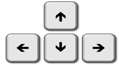
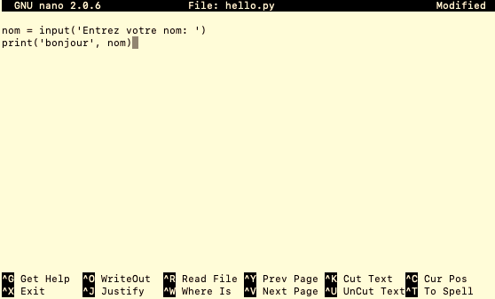
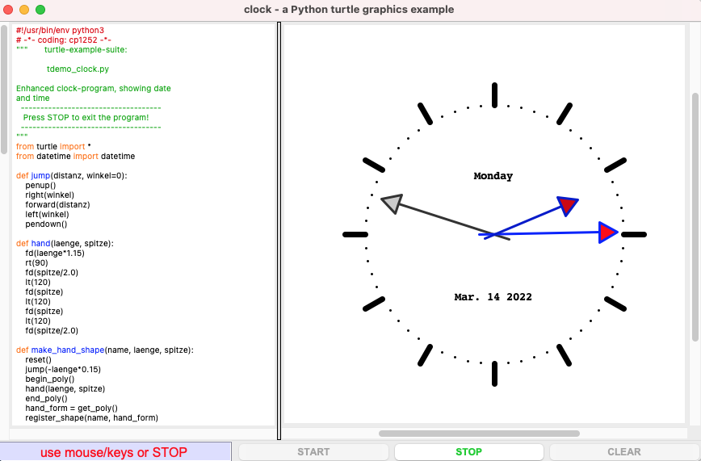
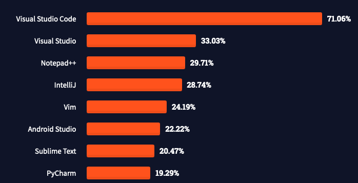

# Annexe

Dans ce chapitre, nous présentons quelques outils pour écrire du code en Python :

- console
- éditeur geek nano
- éditeur simple IDLE
- éditeur débutant Thonny
- éditeur pro VS Code
- éditeur avancé Jupyter Lab

Nous montrons également comment configurer l'apparence de la fenêtre du module `turtle` et comment sauvegarder une image en format EPS.

```{question}
Un IDE est

{f}`un éditeur d'ID (ID editor en anglais)`  
{f}`un installateur d'édition`  
{v}`un environnement de dévelopement intégré`  
{f}`un éditeur de données intégrale`
===
IDE est l'abbréviation de *Integrated Development Environment*.  Il comporte un éditeur de texte destiné à la programmation, une console, et des boutons pour démarrer le compilateur ou un débogueur.
```

## Console

Vous pouvez lancer une séance Python directement dans un terminal. Sur un Mac, démarrez l'application **Terminal**. Dans la console qui s'ouvre, tapez `python3`. Ceci ouvre une séance interactive de Python.

Après avoir affiché la version de Python (ci-dessous c'est 3.10.0), la console Python affiche un invite (prompt en anglais) qui consiste de 3 chevrons (`>>>`).


Entrez une expression en Python, par exemple `1 + 2`. Appuyez sur la touche `Enter` pour évaluer l'expression et afficher le résultat sur la ligne suivante. Un nouveau invite est alors présenté.

Essayez d'entrer une commande multi-ligne, par exemple une boucle `for`. L'invite change alors vers un invite de continuation (`...`). Pour évaluer une séquence multi-ligne, terminez par une ligne vide.

Vous ne pouvez pas éditer une expression qui est déjà exécutée. Vous ne pouvez seulement ajouter une nouvelle expression après l'invite (`>>>`) de la dernière ligne.



Par contre vous pouvez utiliser les flèches haut/bas pour accéder à l'historique de vos expressions. Ceci vous permet de réutiliser et modifier des expressions que vous avez déjà utilisées auparavant.

Pour quitter tapez la commande `quit()`.

## nano

L'éditeur **nano** est un simple éditeur de texte pour Unix, Linux et Mac. Ce n'est pas un IDE. Pour lancer nano depuis la console tapez
`nano hello.py`.

Ceci ouvre l'éditeur nano avec un nouveau fichier nommé `hello.py`. Entrez alors les deux lignes de code suivant.



L'éditeur nano utilise la touche `ctrl` pour ses commandes :

- appuyez sur `ctrl+O` pour sauvegarder le fichier,
- appuyez sur `ctrl+X` pour quitter nano.

Ensuite vous pouvez lancer votre programme depuis la console avec
`python3 hello.py` qui affiche quelque chose comme ceci :

```text
Entrez votre nom: Guido
bonjour Guido
```

## IDLE

L'éditeur IDLE est un environnement de développement intégré (IDE) pour Python. Il est entièrement écrit en Python et utilise la bibliothèque graphique Tkinter. Vous pouvez le télécharger depuis le site [python.org](https://www.python.org/downloads/).

IDLE signifie *Integrated DeveLopment Environment* (environnement de développement intégré, en français).

L'éditeur IDLE

- utilise une coloration syntaxique,
- propose l'auto-complétion des commandes,
- gère automatiquement l'indentation.


L'éditeur IDLE permet également d'éditer un fichier code et de l'exécuter avec la commande **Run > Run Module** (F5).
Plusieurs fenêtres de code peuvent être ouvertes simultanément. Vous pouvez les regrouper dans une seule fenêtre avec la commande **Window > Merge All Windows**.


Dans le menu **Help > Turtle Demo** vous trouvez des exemples programmés avec le module `turtle`. Dans le menu **Exemple** choisissez par exemple `clock` et appuyez sur **Start**.



Les avantages par rapport à Thonny:

- vous disposez de la dernière version de Python (3.10),
- vous pouvez utiliser des émoticônes.

## Thonny

Pour débuter avec Python, nous proposons d'utiliser l'éditeur Thonny, qui a été spécialement conçu pour l'apprentissage de Python. Il peut être téléchargé depuis le site [thonny.org](https://thonny.org) et il est très facile à installer.

Comme IDLE, l'éditeur Thonny est aussi entièrement programmé en Python en utilisant l'interface graphique Tkinter.


Les avantages de Thonny par rapport à IDLE sont qu'il :

- combine éditeur et console,
- peut afficher les variables,
- peut exécuter les instructions pas-à-pas,
- peut programmer l'ordinateur mono-carte micro:bit,
- peut installer des modules supplémentaires.

## VS Code

Visual Studio Code est un éditeur de code multi-plateforme, open source et gratuit, développé par Microsoft. Vous pouvez le télécharger depuis [code.visualstudio.com](https://code.visualstudio.com).

Dans le sondage auprès des développeurs réalisé par Stack Overflow en 2021, Visual Studio Code a été classé comme l'outil d'environnement de développement le plus populaire, avec 71 % des 82 000 répondants déclarant l'utiliser.



## Jupyter Lab

Jupyter Lab est un environnement de programmation qui combine code et document dans un seul document et qui tourne dans un navigateur web. Vous pouvez l'installer facilement depuis Thonny.

- Choisissez le menu **Outils > Gérer les paquets...**
- Cherchez le module `jupyterlab``
- Cliquez sur **Installer**


Ensuite vous devez lancer un serveur Jupyter en local sur votre ordinateur.

- Choisissez le menu **Outils > Ouvrir la console du système...**
- Tapez `cd`
- Tapez `jupyter lab`

La commande `cd` (changer directory) vous place dans votre dossier de l'utilisateur (home). La commande `jupyter lab` lance un serveur Jupyter et ouvre une page web à l'adresse `http://localhost:8888/lab`.

Vous devez laisser ouvert le terminal, pour pouvoir utiliser Jupyter Lab dans le navigateur.

Jupyter Lab est un éditeur qui vous permet d'afficher un navigateur de fichier qui vous permet d'ouvrir et afficher :

- des Jupyter notebooks (.ipynb)
- des consoles
- des données (CSV)
- des images (PNG, JPG)

Un fichier Jupyter notebook permet de combiner code et documentation. Le notebook est composé de blocs qui peuvent être

- documentation (en Markdown)
- code (en Python)
- résultat

## Configuration turtle

L'apparence de la fenêtre du module `turtle` peut être configuré par un  fichier de configuration.  
Vous pouvez télécharger ce fichier et le placer dans le même dossier ou vous gardez vos programmes Python.

Comme dans le navigateur web, il met la taille de la fenêtre à 600 x 400 pixels. Le curseur a la forme de tortue (`shape = turtle`) et la couleur de base est indigo, une des couleurs du logo Modulo.

```{codeplay}
:file: turtle.cfg
:static:
width = 640
height = 440
leftright = -1
topbottom = 0
canvwidth = 600
canvheight = 400
mode = standard
colormode = 1.0
delay = 10
undobuffersize = 1000
shape = turtle
pencolor = indigo
fillcolor = white
resizemode = noresize
visible = True
language = english
exampleturtle = turtle
examplescreen = screen
title = Modulo - Programmation
using_IDLE = False
```

## Exporter en EPS

Pour exporter un dessin en format EPS (Encapsulated PostScript) il suffit de copier les 2 lignes ci-dessous à la fin de votre code. Remplacez `fichier.eps` par le nom de votre fichier, par exemple `rubik.eps`.

```python
from tkinter import * 
Screen().getcanvas().postscript(file='fichier.eps')
```

## Exporter en JPG ou PNG

Sur un Mac un document en format EPS s'ouvre avec le programme Aperçu. Vous pouvez facilement exporter l'image sous un autre format.

- Choisissez le menu **Fichier > Exporter…**
- Sélectionnez le format : JPEG, TIFF ou PNG
- Choisissez la qualité (entre minimale/maximale)
- Choisissez la résolution (pixels/pouce)


## Créer un fond d'écran

Un écran HD (High définition) a une résolution de 1920 x 1080 pixels.
Avec la tortue nous allons d'abord créer une image avec la moitié de cette résolution qui est 960 x 540 pixels.
L'expérience montre qu'il faut ajouter 2-3 pixels et donc viser une taille de 963 x 542 pixels.

Ajoutez au début du programme cette ligne.

```python
Screen().setup(width=963, height=542, startx=0, starty=0)
```

Ajoutez à la fin du programme ces lignes

```python
from tkinter import * 
Screen().getcanvas().postscript(file='wallpaper.eps')
done()
```

Avec Aperçu ouvrez le fichier `wallpaper.eps`.
Doublez la résolution de 72 à 144 pixels/pouce


Ceci donne comme résultat un fichier PNG avec une résolution de 1920 x 1080 pixels.
